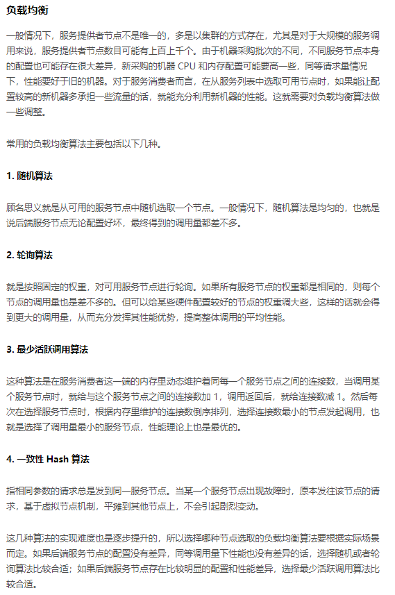
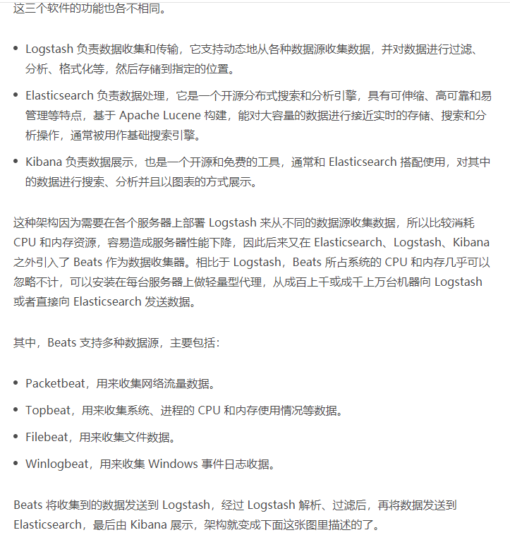
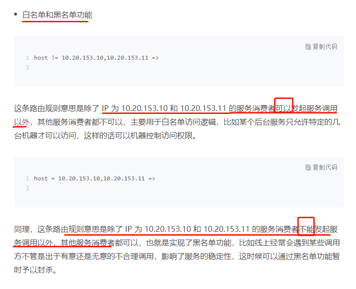

***1:微服务架构的模块图***

 

***2:服务调用主要依赖下面几个基本组件***

 

***3:微服务各个基本组件的原理和实现方式***
			A:服务发布和引用
	

***4:实现RPC远程服务调用***

***5:如何监控微服务调用***

***6:如何追踪微服务调用***

***7:微服务治理的手段***

**A:节点管理**

**B:负载均衡**

**C:服务路由**

**D:服务容错**

**8:如何将注册中心落地**

*注册与发现的几个问题*

**开源服务注册中心如何选型**

**开源RPC框架如何选型**

*A:Dubbo*

*B:Motan*

*C:Tars*

*D:SpringCloud*

*E:gRPC*

*F:Thrift*

**如何搭建一个可靠的监控系统**

**如何搭建一套适合你的服务追踪系统**

**如何识别服务节点是否存活**

**如何使用负载均衡算法**

**如何使用服务路由**

**服务端出现故障时该如何应对**

**服务调用失败时有哪些处理手段**

**如何管理服务配置**

**如何搭建微服务治理平台**

